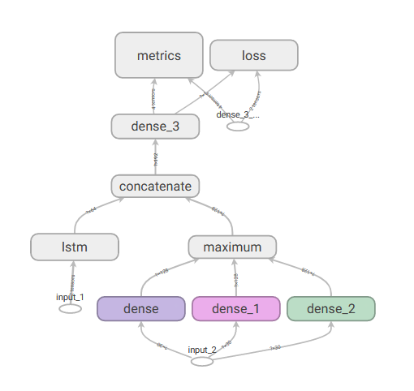
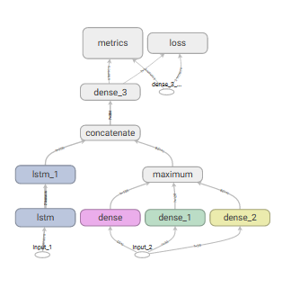
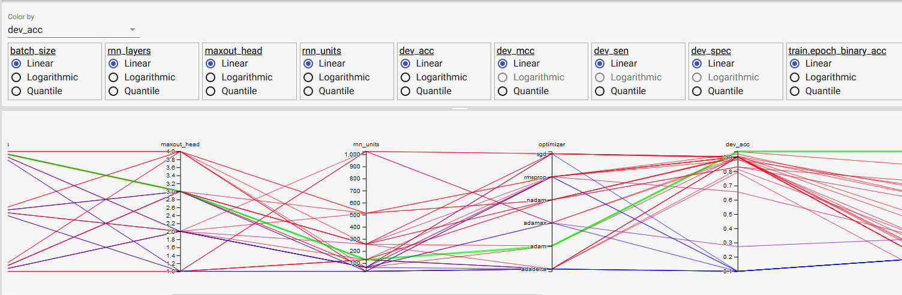

# Ion-Channel-Classification

## 1.Feature:
Sequence Protein is converted to PSSM (length=15, dimentions=20) and CB feature (dimentions=30)

## 2. Evaluation Metric:
- Binary Accuracy
- Binary Search Results
- Binary MCC (Matthews Correlation Coefficient)
- Binary Sensitivity (True Positive Rate)
- Binary Specitivity (True Negative Rate)

## 3. Model Topology:
- 2 head input with 
    - PSSM to a RNN (LSTM for specific)
    - CB to a Maxout layer
- Concate output from RNN layer and Maxout layer 
- Last layer is Logictic Regression classifier

## 4. Hyper parameter:
- Threshold
- Batch size
- Number of epochs
- Optimizer
- Number of Maxout heads (1 for '*relu*' activation)
- Number of Maxout units
- Number of RNN layers
- Number of RNN units

## 5. Cross-validation:
- Using k-fold for cross-validation (5-fold for specific)

## 6. Hyper parameter Tuning:
- Using Random Search for the hyper-parameter.

## 7. Visualization: 
- Using Tensorboard for visualizing difference training session.
- Train result is from mean of training set of 5 fold training
- Dev result is from mean of validation set of 5 fold training
- Test result is from independence test set of training on full data

## 8. Data:
- Data is automatically download from Google Drive (csv file) and parse to PSSM and CB feature respectively

## 9. Result:

